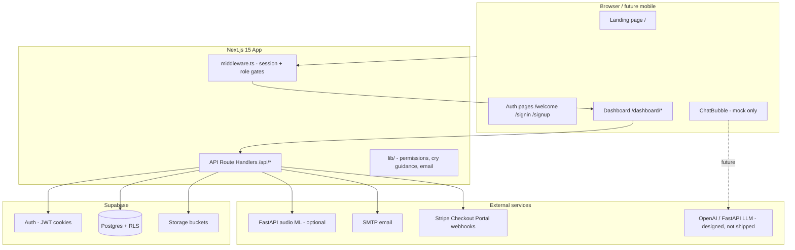
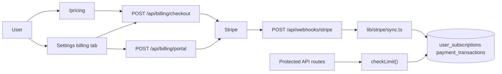

# MamtaAI — Full Project Planning Document

> **Purpose:** Share this document with GPT (or any planner) to design the next modules—payments, chatbot, mobile app, IoT, admin, etc.  
> **Last updated:** June 2026  
> **Product:** MamtaAI · **Repository:** `mamtaAi` (GitHub folder name; npm package: `mamtaai`)  
> **Built by:** [Abrar Ahmed](https://www.abrarahmed.pro/) · [GitHub](https://github.com/AbrarAhmed111)

---

## 1. Product vision

**MamtaAI** is an AI-powered baby care platform for parents and caregivers. Core value proposition:

- Record or upload baby cries and get **ML-based cry classification** (hunger, sleepy, pain, discomfort, etc.) with confidence and urgency.
- Track **daily activities** (feeding, sleep, diaper, medicine, milestones).
- Manage **multiple babies** and **multi-parent / caregiver** access with invites and permission levels.
- View **insights** from cry history (trends, distributions, urgency counts).
- Participate in a **community** (blog, forum, shared resources, favorites).
- Receive **in-app notifications** with configurable preferences.
- Subscribe to **Free, Plus, or Pro** plans with Stripe billing and usage-based feature limits.

**User roles & account types** (`profiles`):

| Account type | `role` | `is_expert` | Description |
|--------------|--------|-------------|-------------|
| **Parent** | `parent` | `false` | Default; full parent dashboard after onboarding |
| **Parent + Expert** | `parent` | `true` | Verified healthcare professional; can switch Parent ↔ Expert views |
| **Admin** | `admin` | `false` | Platform admin; Admin dashboard + optional Parent preview |

- **`role = 'expert'` is deprecated** — use `is_expert` on a `parent` row instead (see `supabase/profiles_is_expert.sql`).
- Expert applicants stay `role = parent`, `is_expert = false` until admin approval; application tracked in `expert_applications`.
- **`is_verified`** on `profiles` indicates account/expert verification state (parents are auto-verified on signup).

**Positioning (marketing site):** Landing page at `/` advertises cry translation, health monitoring, community, privacy, and subscriptions. Pricing CTAs route to `/pricing`.

---

## 2. Tech stack

| Layer | Technology |
|-------|------------|
| Framework | **Next.js 15.5** (App Router), **React 19**, **TypeScript 5.8** |
| Backend (app) | Next.js **Route Handlers** under `src/app/api/*` |
| Database & auth | **Supabase** (Postgres, Auth, Storage, RLS) |
| Styling | **Tailwind CSS 3**, `clsx`, `tailwind-merge`, `framer-motion` |
| State | **Redux Toolkit** (minimal—`SampleSlice` only; most state is local/fetch) |
| Email | **Nodemailer** + HTML templates in `src/lib/email/` |
| HTTP client | **axios** (where used) |
| Audio ML (external) | Optional **FastAPI** backend at `NEXT_PUBLIC_BACKEND_URL` (default `http://localhost:8000`) |
| Payments | **Stripe** (`stripe` npm package) — Checkout, Customer Portal, webhooks |
| Quality | ESLint, Prettier, Husky, Commitlint (Conventional Commits) |
| Tests | Jest + Testing Library (scaffold present; not heavily used) |

**Not in dependencies today:** OpenAI SDK, push notification SDKs, mobile native stack.

---

## 3. High-level architecture



**Request flow (cry recording):**

1. User records/uploads audio in dashboard → `POST /api/audio/process` or recordings APIs.
2. Audio may be sent to FastAPI for noise reduction / feature extraction.
3. File stored in Supabase Storage bucket `recordings`.
4. Row inserted in `recordings` table.
5. Client/backend posts prediction payload → `POST /api/recordings/[id]/prediction` → `cry_predictions` row.
6. Insights API aggregates `recordings` + `cry_predictions` on read (does not use `weekly_insights` table yet).

---

## 4. Repository structure

```text
mamtaAi/
├── docs/
│   ├── PROJECT_PLANNING_DOCUMENT.md    ← this file
│   ├── CHATBOT_LLM_RAG.md              ← chatbot architecture (design only)
│   ├── CHATBOT_OPENAI_IMPLEMENTATION.md
│   └── CHATBOT_PYTHON_FASTAPI_PLAN.md
├── supabase/                           ← SQL migrations (run in Supabase SQL Editor)
│   ├── admin_setup.sql                 ← content_reports, audit_logs, error_logs, discount_coupons
│   ├── expert_flow.sql                 ← expert_applications, profiles.active_view
│   ├── profiles_is_expert.sql          ← is_expert column; role parent|admin only
│   ├── profiles_last_active_at.sql
│   ├── discount_coupons.sql
│   └── content_reports_blog_comment.sql
├── parent_invites_setup.sql            ← baby_invites table + RLS (run in Supabase)
├── src/
│   ├── app/
│   │   ├── page.tsx                    ← marketing landing
│   │   ├── (auth)/                     ← signin, signup, welcome, verify-email, reset-password
│   │   ├── auth/role, auth/expert-application
│   │   ├── onboarding/                 ← expert pending approval countdown
│   │   ├── account-suspended/          ← suspended account message
│   │   ├── invite/[token]/             ← accept family invite
│   │   ├── dashboard/                  ← main product UI
│   │   │   ├── admin/*                 ← admin panel pages
│   │   │   ├── expert/*                ← expert profile & articles
│   │   │   └── expert-application/     ← in-app expert apply form
│   │   ├── pricing/                    ← public plan comparison page
│   │   ├── billing/success/            ← post-checkout confirmation
│   │   └── api/                        ← route handlers (incl. /api/admin/*, /api/experts/*)
│   ├── components/
│   │   ├── Dashboard/                  ← sidebar, widgets, baby modals
│   │   ├── Dashboard/Admin/            ← admin tables, queues, overview
│   │   ├── Dashboard/Expert/           ← expert overview, profile editor, switcher
│   │   ├── auth/
│   │   ├── Chat/                       ← MamtaBot UI (mock responses)
│   │   ├── pricing/                    ← PricingPage, pricing-data
│   │   ├── subscription/               ← PlanChangeModal, usage banners, badges
│   │   └── ui/
│   ├── hooks/
│   │   ├── useSubscription.tsx         ← client subscription context
│   │   ├── useBilling.ts               ← checkout / portal helpers
│   │   └── useSessionReconcile.ts      ← mid-session profile/subscription sync
│   ├── lib/
│   │   ├── supabase/                   ← client, server, middleware, actions
│   │   ├── expert/                     ← applications, active-view, profile-role
│   │   ├── admin/                      ← requireAdminApi, user-options, audit
│   │   ├── session/                    ← requireActiveProfile, dashboardFetch
│   │   ├── subscription/               ← plans, limits, usage, service
│   │   ├── stripe/                     ← client, checkout, sync, prices
│   │   ├── baby-permissions.ts
│   │   ├── cry-urgency.ts, cry-type-guidance.ts, baby-health-suggestions.ts
│   │   ├── notification-preferences.ts
│   │   ├── notifications/              ← admin, expert-application, sticky-expert
│   │   └── email/
│   ├── types/
│   │   └── schema.sql                  ← full planned DB schema (~3.3k lines)
│   └── middleware.ts
└── README.md
```

---

## 5. Environment variables

| Variable | Purpose |
|----------|---------|
| `NEXT_PUBLIC_BASE_URL` | App base URL |
| `NEXT_PUBLIC_BACKEND_URL` | FastAPI audio/ML service |
| `NEXT_PUBLIC_SITE_URL` | Site URL for links |
| `NEXT_PUBLIC_SUPABASE_URL` | Supabase project URL |
| `NEXT_PUBLIC_SUPABASE_ANON_KEY` | Supabase anon key (client) |
| `SUPABASE_SERVICE_ROLE_KEY` | Server-side admin ops (invites, storage, notifications) |
| `SMTP_HOST`, `SMTP_PORT`, `SMTP_SECURE`, `SMTP_FROM_EMAIL`, `SMTP_USER`, `SMTP_PASS` | Transactional email |
| `MODEL_CONFIDENCE_THRESHOLD` | Optional; cry prediction confidence cutoff |
| `STRIPE_SECRET_KEY` | Stripe secret key (server) |
| `STRIPE_WEBHOOK_SECRET` | Stripe webhook signing secret |
| `STRIPE_PRICE_PLUS_MONTHLY` | Stripe Price ID for Plus plan |
| `STRIPE_PRICE_PRO_MONTHLY` | Stripe Price ID for Pro plan |
| `NEXT_PUBLIC_STRIPE_PUBLISHABLE_KEY` | Optional; Stripe publishable key (client) |
| `NEXT_PUBLIC_STRIPE_PRICE_PLUS_MONTHLY` | Optional fallback if DB `stripe_price_id` unset |
| `NEXT_PUBLIC_STRIPE_PRICE_PRO_MONTHLY` | Optional fallback if DB `stripe_price_id` unset |

**Planned (documented in chatbot docs, not in app yet):** `OPENAI_API_KEY`, `OPENAI_*` model settings.

---

## 6. Authentication & authorization

### 6.1 Auth provider

- **Supabase Auth** with SSR cookies via `@supabase/ssr`.
- Client context: `src/lib/supabase/context.tsx` → `GET /api/auth/me`.
- Middleware: `src/lib/supabase/middleware.ts` refreshes session and enforces routes.

### 6.2 Route protection

| Path pattern | Behavior |
|--------------|----------|
| `/`, `/welcome`, `/signin`, `/signup`, etc. | Public or auth-only |
| `/dashboard`, `/onboarding` | Requires logged-in user with valid profile |
| `/dashboard/admin/*` | Requires `profiles.role = admin` (middleware redirect) |
| `/dashboard/expert/*` | Requires `profiles.is_expert = true` (middleware redirect) |
| `/api/auth/*`, `/api/webhooks/*` | Excluded from session profile gate |
| Other `/api/*` | Blocked if profile missing or suspended (JSON + `x-session-invalid` header) |
| Expert applicant (pending) | Stays on parent dashboard; status card + `/onboarding?status=pending` after apply |
| User without `profiles.role` | Redirect to `/auth/role` |
| Suspended account | Redirect to `/account-suspended`; API returns `account_suspended` |

### 6.3 Mid-session authorization (shipped)

JWT sessions can outlive DB changes (role demotion, suspension, deletion, plan change). The app reconciles live authorization state:

| Mechanism | Location | Behavior |
|-----------|----------|----------|
| **`GET /api/session/status`** | `src/app/api/session/status/route.ts` | Returns live `role`, `isExpert`, `suspended`, `subscriptionSlug` |
| **`requireActiveProfile()`** | `src/lib/session/server.ts` | Server helper; used by `/api/auth/me`, `/api/profile`, `/api/subscription` |
| **Middleware API gate** | `src/lib/supabase/middleware.ts` | Blocks deleted/suspended profiles on all protected API routes |
| **`dashboardFetch()`** | `src/lib/session/client.ts` | Client wrapper; detects `x-session-invalid` and triggers logout/redirect |
| **`useSessionReconcile`** | `src/hooks/useSessionReconcile.ts` | Polls every 90s + on window focus; refreshes profile/subscription on access change |
| **Admin session revoke** | `src/app/api/admin/users/[id]` | On suspend / expert removal / admin demotion → global Supabase sign-out |

Invalid codes: `unauthenticated`, `account_deleted`, `account_suspended`.

### 6.4 Baby-level permissions (`baby_parents`)

Fields used in app logic (`src/lib/baby-permissions.ts`):

- `is_primary` — primary parent (invite management, delete baby).
- `can_edit_profile`, `can_record_audio`, `can_view_history`.
- `access_level`: `full` | `read_only` | `limited`.
- `invitation_status`: `pending` | `accepted` | `declined` | `revoked`.
- `relationship`: mother, father, guardian, caregiver, grandparent, other.

**Family invites:** Separate table `baby_invites` (see `parent_invites_setup.sql`) with token-based accept flow at `/invite/[token]`.

---

## 7. Implemented features (today)

### 7.1 Authentication & profile ✅

- Email/password signup, sign-in, email verification, password reset.
- Role selection at signup: **Parent** or **Expert applicant** (expert path sets `metadata.expert_application_intent`; DB row stays `role = parent`).
- Profile CRUD (`/api/profile`, settings page).
- Avatar upload → Storage bucket `profile-avatars`.

### 7.2 Baby management ✅

- Create/list/update/delete babies.
- Baby avatar → `baby-avatars` bucket.
- Baby detail page with activities and family section.
- **Activities API:** feeding, sleep, diaper, play, bath, medicine, milestone, other.

### 7.3 Family & invites ✅

- Primary parent sends invites by email (`/api/babies/[id]/invites`).
- Pending invites list (`/api/invites/pending`).
- Accept/decline via token (`/api/invites/[token]`, `/invite/[token]`).
- Member list, permission updates, remove member, leave baby (`membership` API).
- Invite emails via Nodemailer templates.

### 7.4 Recordings & cry AI ✅ (with external ML)

- Upload/live record → storage + `recordings` row.
- Proxy to FastAPI via `/api/audio/process`.
- Save extracted features → `/api/recordings/[id]/features`.
- Save predictions → `/api/recordings/[id]/prediction` (urgency derived in `cry-urgency.ts`).
- Recordings list/delete in dashboard.
- Static guidance: `cry-type-guidance.ts`, `baby-health-suggestions.ts`.

### 7.5 Insights ✅ (computed on the fly)

- `GET /api/insights` — aggregates last 30 days of recordings + latest prediction per recording.
- Metrics: today’s recordings, confidence, urgent count, cry type distribution, daily/hourly trends, per-baby breakdown.
- **Note:** Does not read/write `weekly_insights` or `daily_cry_stats` tables.

### 7.6 Notifications ✅ (partial)

- `notifications` table: fetch, mark read (`/api/notifications`).
- Settings UI stores preferences in `profiles.metadata` (parsed by `notification-preferences.ts`).
- Community events trigger inserts via service role (`community-notifications.ts`).
- **Not implemented:** push/email/SMS delivery pipelines, `notification_templates`, scheduled sends.

### 7.7 Community ✅

| Feature | API / UI |
|---------|----------|
| Blog posts | CRUD, likes, comments, favorites, views |
| Forum | Categories, threads, replies, likes |
| Resources | Upload, download counter, CRUD |
| Guidelines | Static page |
| Favorites | Saved blog posts |

Auxiliary tables used in code (may not be in main `schema.sql` excerpt): `blog_post_likes`, `blog_post_favorites`, `blog_post_views`, `forum_thread_likes`, `forum_reply_likes`.

### 7.8 Dashboard UX ✅

- Sidebar: Dashboard, My Babies, Recordings, Insights, Community, Experts, Settings.
- Plan badge / upgrade promo in sidebar (Free users see upsell card).
- Welcome checklist, quick actions, progress widgets.
- **Chat UI:** `ChatBubble` + `useMockChat.ts` — **no real `/api/chat`**.

### 7.9 Marketing site ✅

- Full landing page: features, FAQ, testimonials, footer.
- Pricing CTAs link to `/pricing` (functional plan comparison page).

### 7.10 Payments & subscriptions ✅

**Status:** Implemented — Stripe Checkout, Customer Portal, webhooks, plan limits, and billing UI.

**Plans (Free / Plus / Pro):** Definitions in `src/lib/subscription/plans.ts`; seeded to `subscription_plans` via `seedSubscriptionPlansIfMissing()`. New users get **Free** on signup (`ensureFreeSubscription` in auth callback and signup flow).

| Plan | Price | Highlights |
|------|-------|------------|
| **Free** | $0 | 1 baby, 7 cry analyses/month, 30s recordings, 7-day insights, read-only community |
| **Plus** | $9.99/mo | 3 babies, 60 analyses/month, 2-min recordings, 2 caregivers, 90-day insights, 1 export/month |
| **Pro** | $19.99/mo | Unlimited babies/caregivers (soft caps), unlimited analyses (fair use), 5-min recordings, all-time insights |

**Stripe integration (`src/lib/stripe/`):**

- **Checkout** — `createCheckoutOrUpgrade()`: new subscribers → Stripe Checkout; existing subscribers → in-place upgrade (proration) or scheduled downgrade at period end.
- **Customer Portal** — `createBillingPortalSession()` for payment method, invoices, cancellation.
- **Webhooks** — `POST /api/webhooks/stripe` handles: `checkout.session.completed`, `customer.subscription.created/updated/deleted`, `invoice.paid`, `invoice.payment_failed`.
- **Sync** — `sync.ts` maps Stripe subscription status → `user_subscriptions`, records `payment_transactions` on `invoice.paid`, downgrades to Free on cancellation.

**Plan limit enforcement (`src/lib/subscription/limits.ts`):**

- `checkLimit(userId, action, metadata)` returns 403 with `error: "PLAN_LIMIT_REACHED"` when exceeded.
- Enforced in API routes: babies, recordings, audio/process, family invites, activities, blog, forum, resources, insights export.
- Insights API filters history by `insights_history_days` and gates full charts via `insights_full_charts`.
- Usage counters stored in `user_subscriptions.usage_stats` (synced from DB counts monthly).

**User-facing surfaces:**

| Route / component | Purpose |
|-------------------|---------|
| `/pricing` | Public plan comparison, FAQ, upgrade CTAs |
| `/dashboard/settings?tab=billing` | Current plan, usage meters, billing history, manage billing |
| `/billing/success` | Post-checkout confirmation |
| `PlanChangeModal` | Upgrade/downgrade confirmation for logged-in users |
| `PlanUsageBanner`, `PlanHeaderBadge` | In-dashboard usage and plan indicators |
| `SubscriptionProvider` (`useSubscription`) | Client context from `GET /api/subscription` |
| `useBilling` | Checkout and portal session helpers |

**Billing API routes:**

| Method | Path | Description |
|--------|------|-------------|
| GET | `/api/subscription` | Current plan, usage, meters, billing metadata, all plan definitions |
| POST | `/api/billing/checkout` | Start Checkout or apply upgrade/downgrade |
| POST | `/api/billing/portal` | Stripe Customer Portal session |
| POST | `/api/billing/confirm` | Confirm Checkout after redirect (session sync) |
| GET | `/api/billing/history` | Payment transaction history |
| POST | `/api/webhooks/stripe` | Stripe webhook handler (raw body, signature verified) |

**Not implemented yet:** annual billing, free trials, chat gating by plan.

### 7.11 Expert flow ✅

**Status:** Implemented — application, admin approval, directory, dual dashboard views. Consultations/booking were removed from scope.

**Account model:** Verified experts are **`role = parent`** + **`is_expert = true`**. Applicants remain parents until approved (`expert_applications.status = pending`).

**User journey:**

1. Signup or OAuth → choose Parent or Expert at `/auth/role`.
2. Expert path → `/auth/expert-application` (document upload required) → `POST /api/experts/apply`.
3. Pending → `/onboarding?status=pending` (countdown) → parent dashboard with **Request status** card.
4. Admin approves → `is_expert = true`, `active_view = expert`, verification data copied to `profiles.verification_data`.
5. Verified expert toggles **Parent ↔ Expert** view via header switcher (`PATCH /api/profile/active-view`).

**Expert dashboard routes (`active_view = expert`):**

| Route | Purpose |
|-------|---------|
| `/dashboard` | Expert overview (stats, quick actions) |
| `/dashboard/expert/profile` | Public directory profile editor |
| `/dashboard/expert/articles` | Article authoring entry (links to community blog) |
| `/dashboard/experts` | Public expert directory (all users) |

**Key APIs:**

| Method | Path | Description |
|--------|------|-------------|
| GET/POST | `/api/experts/apply` | Application status / submit application |
| GET/PATCH | `/api/experts/profile` | Expert profile read/update (verified experts) |
| GET | `/api/experts/dashboard` | Expert overview stats |
| GET | `/api/experts` | Verified expert directory + expert articles |
| POST | `/api/uploads/expert-document` | Verification document upload |
| PATCH | `/api/profile/active-view` | Switch parent/expert (or admin/parent preview) |

**SQL migrations:** `supabase/expert_flow.sql`, `supabase/profiles_is_expert.sql`.

**Key code:** `src/lib/expert/`, `src/components/Dashboard/Expert/`, `src/app/auth/expert-application/`.

### 7.12 Admin panel ✅

**Status:** Implemented — overview, users, expert verification, moderation, subscriptions, coupons, system logs.

**Access:** `profiles.role = admin`. Admins can preview the parent dashboard via **Admin ↔ Parent** switcher (`metadata.admin_dashboard_view`).

**Admin routes:**

| Route | Purpose |
|-------|---------|
| `/dashboard` (admin view) | Platform stats, pending experts count, recent signups |
| `/dashboard/admin/users` | Search/filter users (Parent, Parent + Expert, Admin) |
| `/dashboard/admin/users/[id]` | User detail: edit role, toggle expert, suspend, delete |
| `/dashboard/admin/experts` | Expert application queue (approve/reject + document review) |
| `/dashboard/admin/moderation` | Content reports queue |
| `/dashboard/admin/subscriptions` | Subscription overview |
| `/dashboard/admin/coupons` | Discount coupon management |
| `/dashboard/admin/logs` | System error logs |

**Admin APIs (`requireAdminApi()`):**

| Method | Path | Description |
|--------|------|-------------|
| GET | `/api/admin/stats` | Platform overview metrics |
| GET | `/api/admin/users` | Paginated user list with role filters |
| GET/PATCH/DELETE | `/api/admin/users/[id]` | User detail, update, delete (+ session revoke on suspend/demotion) |
| GET | `/api/admin/experts` | Pending expert applications |
| PATCH | `/api/admin/experts/[id]` | Approve or reject expert (`action: approve \| reject`) |
| GET | `/api/admin/community` | Moderation content list |
| PATCH | `/api/admin/community/[type]/[id]` | Moderation actions |
| GET/PATCH | `/api/admin/subscriptions`, `[id]` | Subscription admin |
| GET/POST/PATCH/DELETE | `/api/admin/coupons`, `[id]` | Coupon CRUD |
| GET | `/api/admin/logs` | Error log viewer |

**Supporting tables (`supabase/admin_setup.sql`):** `content_reports`, `audit_logs`, `error_logs`, `discount_coupons`.

**Notifications:** New expert applications create sticky admin notifications until Expert Verification page is visited or application resolved (`src/lib/notifications/sticky-expert-notifications.ts`).

**Suspension:** Stored in `profiles.metadata.suspended`; triggers `/account-suspended` and global session revoke.

**Key code:** `src/lib/admin/`, `src/components/Dashboard/Admin/`, `src/app/dashboard/admin/`.

---

## 8. Schema vs implementation gap

The file `src/types/schema.sql` describes a **production-ready, future-proof** schema. Much of it is **not wired to application code yet**.

### 8.1 Tables actively used by the app

`profiles`, `babies`, `baby_parents`, `baby_invites`, `baby_activities`, `recordings`, `extracted_features`, `cry_predictions`, `notifications`, `blog_posts`, `blog_comments`, `forum_categories`, `forum_threads`, `forum_replies`, `shared_resources`, **`subscription_plans`**, **`user_subscriptions`**, **`payment_transactions`**, **`expert_applications`**, **`content_reports`**, **`audit_logs`**, **`error_logs`**, **`discount_coupons`**, plus social junction tables for likes/favorites/views.

### 8.2 Tables in schema but NOT used in app code (opportunity)

| Domain | Tables | Notes |
|--------|--------|-------|
| **Payments (partial)** | — | Coupon admin UI shipped; optional deeper Checkout validation |
| **Medical** | `baby_medical_conditions` | Allergies, vaccinations, medications |
| **Feedback / ML ops** | `prediction_feedback`, `custom_cry_labels`, `ml_models`, `model_training_batches` | Model improvement loop |
| **IoT** | `oximeter_readings`, `oximeter_devices` | SpO2, pulse, alarms |
| **Analytics aggregates** | `daily_cry_stats`, `weekly_insights`, `health_suggestions` | Pre-computed insights; app computes live instead |
| **E-commerce / reviews** | `product_categories`, `products`, `product_reviews` | Trustpilot integration planned in schema |
| **Analytics events** | `analytics_events` | Product analytics (not wired) |
| **Notification infra** | `notification_templates` | Multi-channel templates |

---

## 9. Complete API catalog

All routes under `src/app/api/`.

### Auth, session & user

| Method | Path | Description |
|--------|------|-------------|
| * | `/api/auth/callback` | OAuth/email confirm; creates profile |
| POST | `/api/auth/login` | Login helper |
| GET | `/api/auth/me` | Current user + profile (`requireActiveProfile`) |
| GET | `/api/session/status` | Live authorization snapshot for mid-session reconcile |
| POST | `/api/auth/confirm` | Email confirmation |
| POST | `/api/auth/reset-password` | Password reset |
| POST | `/api/auth/role` | Set parent vs expert-application intent |
| POST | `/api/auth/expert` | Legacy expert verification fields |
| GET/PATCH | `/api/profile` | Profile read/update |
| PATCH | `/api/profile/active-view` | Switch parent/expert or admin/parent dashboard view |
| GET | `/api/me` | Alias-style user endpoint |
| GET | `/api/user/stats` | Counts: babies, forum, recordings |

### Expert flow

| Method | Path | Description |
|--------|------|-------------|
| GET/POST | `/api/experts/apply` | Application status / submit |
| GET/PATCH | `/api/experts/profile` | Verified expert profile |
| GET | `/api/experts/dashboard` | Expert overview stats |
| GET | `/api/experts` | Public expert directory |
| POST | `/api/uploads/expert-document` | Verification document upload |

### Admin panel

| Method | Path | Description |
|--------|------|-------------|
| GET | `/api/admin/stats` | Platform overview |
| GET | `/api/admin/users` | User list (filters: parent, parent_expert, admin) |
| GET/PATCH/DELETE | `/api/admin/users/[id]` | User CRUD, suspend, session revoke |
| GET | `/api/admin/experts` | Pending expert queue |
| PATCH | `/api/admin/experts/[id]` | Approve/reject expert |
| GET | `/api/admin/community` | Moderation queue |
| PATCH | `/api/admin/community/[type]/[id]` | Moderation action |
| GET/PATCH | `/api/admin/subscriptions`, `[id]` | Subscription admin |
| GET/POST/PATCH/DELETE | `/api/admin/coupons`, `[id]` | Coupon CRUD |
| GET | `/api/admin/logs` | System error logs |

### Babies & family

| Method | Path | Description |
|--------|------|-------------|
| GET/POST | `/api/babies` | List/create babies |
| GET/PATCH/DELETE | `/api/babies/[id]` | Baby CRUD |
| GET/POST | `/api/babies/[id]/activities` | Activity log |
| GET/POST/PATCH/DELETE | `/api/babies/[id]/members` | Caregivers |
| DELETE | `/api/babies/[id]/membership` | Leave baby |
| GET/POST/PATCH | `/api/babies/[id]/invites` | Family invites |
| GET | `/api/invites/pending` | User's pending invites |
| GET/POST | `/api/invites/[token]` | View/accept invite |

### Recordings & audio

| Method | Path | Description |
|--------|------|-------------|
| GET/POST | `/api/recordings` | List/create |
| GET/DELETE | `/api/recordings/[id]` | Detail/delete (+ storage cleanup) |
| POST | `/api/recordings/[id]/features` | Save ML features |
| POST | `/api/recordings/[id]/prediction` | Save cry prediction |
| POST | `/api/audio/process` | Upload + optional FastAPI processing |

### Insights & notifications

| Method | Path | Description |
|--------|------|-------------|
| GET | `/api/insights` | Dashboard analytics (computed; plan-aware history) |
| GET | `/api/insights/export` | CSV export (Plus+; plan limit enforced) |
| GET/PATCH | `/api/notifications` | List/mark read |

### Uploads

| POST | `/api/uploads/profile-avatar` |
| POST | `/api/uploads/baby-avatar` |
| POST | `/api/uploads/resource` | Community resource files |

### Community — blog

| GET/POST | `/api/community/blog` |
| GET/PATCH/DELETE | `/api/community/blog/[id]` |
| GET/POST | `/api/community/blog/[id]/comments` |
| PATCH/DELETE | `/api/community/blog/comments/[id]` |
| POST | `/api/community/blog/[id]/like` |
| POST/DELETE | `/api/community/blog/[id]/favorite` |
| GET | `/api/community/blog/favorites` |
| POST | `/api/community/blog/comments/[id]/like` |

### Community — forum

| GET | `/api/community/forum/categories` |
| GET/POST | `/api/community/forum/threads` |
| GET/PATCH/DELETE | `/api/community/forum/threads/[id]` |
| GET/POST | `/api/community/forum/threads/[id]/replies` |
| POST | `/api/community/forum/threads/[id]/like` |
| PATCH/DELETE | `/api/community/forum/replies/[id]` |
| POST | `/api/community/forum/replies/[id]/like` |

### Community — resources

| GET/POST | `/api/community/resources` |
| GET/PATCH/DELETE | `/api/community/resources/[id]` |
| POST | `/api/community/resources/[id]/download` |

### Subscription & billing

| Method | Path | Description |
|--------|------|-------------|
| GET | `/api/subscription` | Current plan, usage meters, billing metadata |
| POST | `/api/billing/checkout` | Stripe Checkout or in-place plan change |
| POST | `/api/billing/portal` | Stripe Customer Portal session |
| POST | `/api/billing/confirm` | Confirm Checkout session after redirect |
| GET | `/api/billing/history` | Payment transaction history |
| POST | `/api/webhooks/stripe` | Stripe webhook handler (subscription + invoice sync) |

---

## 10. Dashboard pages (UI routes)

| Route | Status |
|-------|--------|
| `/dashboard` | Home dashboard |
| `/dashboard/babies` | Baby list |
| `/dashboard/babies/add-baby` | Create baby |
| `/dashboard/babies/[id]` | Baby profile + activities + family |
| `/dashboard/recordings` | Recording history |
| `/dashboard/insights` | Charts from `/api/insights` |
| `/dashboard/community` | Community hub |
| `/dashboard/community/blog/*` | Blog list, detail, create |
| `/dashboard/community/forums/*` | Forum threads |
| `/dashboard/community/resources/*` | Resources |
| `/dashboard/community/favorites` | Saved posts |
| `/dashboard/community/guidelines` | Rules |
| `/dashboard/settings` | Profile, notifications, **billing**, **professional/expert** tab, family overview |
| `/dashboard/experts` | Expert directory (verified experts + articles) |
| `/dashboard/expert-application` | In-app expert application form |
| `/dashboard/expert/profile` | Expert public profile editor |
| `/dashboard/expert/articles` | Expert articles entry point |
| `/dashboard/admin/users` | Admin: user management |
| `/dashboard/admin/users/[id]` | Admin: user detail |
| `/dashboard/admin/experts` | Admin: expert verification queue |
| `/dashboard/admin/moderation` | Admin: content moderation |
| `/dashboard/admin/subscriptions` | Admin: subscriptions |
| `/dashboard/admin/coupons` | Admin: discount coupons |
| `/dashboard/admin/logs` | Admin: system logs |
| `/account-suspended` | Suspended account page |
| `/pricing` | Public subscription plans page |
| `/billing/success` | Post-Stripe Checkout confirmation |

---

## 11. Supabase storage buckets (in use)

| Bucket | Used for |
|--------|----------|
| `recordings` | Cry audio files |
| `profile-avatars` | User avatars |
| `baby-avatars` | Baby photos |
| (resources) | Community uploads via `/api/uploads/resource` |

---

## 12. Key domain logic (lib)

| Module | Role |
|--------|------|
| `baby-permissions.ts` | canEdit, canRecord, canDelete, access badges |
| `cry-urgency.ts` | Map cry type + confidence → urgency level |
| `cry-type-guidance.ts` | Static tips per cry type |
| `baby-health-suggestions.ts` | Rule-based health popovers |
| `notification-preferences.ts` | Defaults + parse from profile metadata |
| `community-notifications.ts` | Insert notification rows on community events |
| `email/send-email.ts` + templates | Invites, OTP, forgot password |
| `subscription/plans.ts` | Free / Plus / Pro definitions and limitations |
| `subscription/limits.ts` | `checkLimit()`, usage meters, insights history filter |
| `subscription/service.ts` | Subscription context, usage sync, free plan bootstrap |
| `subscription/errors.ts` | Standardized `PLAN_LIMIT_REACHED` 403 responses |
| `stripe/checkout.ts` | Checkout, upgrade, downgrade scheduling, portal |
| `stripe/sync.ts` | Webhook handlers, Stripe ↔ Supabase sync |
| `stripe/prices.ts` | Price ID resolution (DB + env fallback) |
| `expert/applications.ts` | Expert application status, eligibility, approval payload |
| `expert/active-view.ts` | Parent/expert/admin dashboard view resolution |
| `expert/profile-role.ts` | `is_expert` helpers, account type labels |
| `admin/auth.ts` | `requireAdminApi()`, suspension check |
| `session/server.ts` | `requireActiveProfile()`, session invalid responses |
| `session/client.ts` | `dashboardFetch()`, session invalid handler |
| `notifications/sticky-expert-notifications.ts` | Sticky admin alerts for expert applications |

---

## 13. Planned modules (design docs exist or partial implementation)

### 13.1 MamtaBot — AI parenting assistant

**Status:** UI mock only (`useMockChat.ts`). No `/api/chat`.

**Docs:**

- `docs/CHATBOT_LLM_RAG.md` — RAG + tools + safety + rollout.
- `docs/CHATBOT_OPENAI_IMPLEMENTATION.md` — OpenAI Responses API, embeddings, moderation.
- `docs/CHATBOT_PYTHON_FASTAPI_PLAN.md` — Separate FastAPI service; Next.js thin proxy; Supabase RLS via user JWT.

**Planned capabilities:** Baby-aware Q&A, cry support, insight explanations, community search, expert copilot, moderation assist.

**Suggested new tables (from design):** `knowledge_chunks` + pgvector for RAG (not in `schema.sql` yet).

### 13.2 Payments & subscriptions

**Status:** **Shipped (MVP).** Stripe Checkout, Customer Portal, webhooks, plan limits, pricing page, and billing settings are live in the codebase. See **§7.10** for full detail.

**Architecture summary:**



**Schema in use:**

- `subscription_plans`: slug, price, billing_cycle, features JSON, limitations JSON, `stripe_price_id`.
- `user_subscriptions`: trial/active/cancelled/payment_failed, Stripe IDs, `usage_stats` JSON, `metadata.pending_plan_change` for scheduled downgrades.
- `payment_transactions`: gateway IDs, invoice/receipt URLs (populated on `invoice.paid`).

**Remaining enhancements (not yet built):**

1. Deeper server-side coupon validation at Checkout (admin coupon UI exists).
2. Annual billing cycles and free-trial periods.
3. Gate MamtaBot / chat by plan once `/api/chat` ships.
4. Email receipts or billing notifications beyond Stripe defaults.
5. In-app plan definition editing (subscription/coupon admin UI exists; `subscription_plans` still seeded in code/SQL).
6. Downgrade enforcement when usage exceeds new plan limits at period end.

### 13.3 Other high-value modules (schema-ready, no UI)

| Module | Value | Complexity |
|--------|-------|------------|
| Oximeter / vitals | Differentiator vs generic baby apps | High (device SDK, real-time alerts) |
| Medical history | Safer AI suggestions | Medium |
| Prediction feedback loop | Improve cry model | Medium |
| Weekly insights cron | Cheaper dashboard loads | Low–medium |
| Expert articles tooling | Rich expert publishing workflow | Medium |
| Product reviews / Trustpilot | Social proof on landing | Medium |
| Mobile app (React Native / Expo) | FAQ promises “app coming soon” | High |
| Push notifications (FCM/APNs) | Cry alerts | Medium |

---

## 14. External service dependencies

| Service | Required? | Role |
|---------|-----------|------|
| Supabase | **Yes** | Auth, DB, storage |
| SMTP | **Yes** (for invites/reset) | Email |
| FastAPI backend | **Optional** | Audio processing & ML inference |
| Stripe | **Optional** (required for paid plans) | Subscriptions, Checkout, Portal, webhooks |
| OpenAI | **No** (planned) | Chatbot |
| Vercel/similar | Typical deploy target | Hosting |

---

## 15. Data model reference (core entities)

### profiles

Extended user: `full_name`, `role` (`parent` \| `admin`), `is_expert` (boolean — parent + expert when true), `is_verified`, `active_view` (`parent` \| `expert`), `onboarding_completed`, `verification_data` JSON (expert credentials), `metadata` JSON (notification prefs, suspension, dashboard view preferences).

### expert_applications

Expert signup pipeline: professional fields, document URL, `status` (pending \| approved \| rejected), reapply cooldown, reviewer audit fields.

### babies

`name`, `birth_date`, `gender`, growth fields, `avatar_url`, `medical_notes`, soft delete `is_active`.

### baby_parents

Many-to-many with permissions and invite state.

### recordings → extracted_features → cry_predictions

Pipeline for audio AI. Cry types include: hunger, sleepy, pain, discomfort, colic, teething, scared, attention, overstimulated, cold, hot, unknown.

### baby_activities

Rich activity types with type-specific columns (feeding_type, sleep_quality, etc.).

### subscription_plans → user_subscriptions → payment_transactions

Three-tier model (Free / Plus / Pro). Plan limits live in `limitations` JSON and are enforced via `checkLimit()`. Stripe IDs link paid plans to Checkout; webhooks keep `user_subscriptions` and `payment_transactions` in sync.

---

## 16. Known gaps & technical debt

1. **Subscription edge cases** — scheduled downgrade when current usage exceeds new plan limits; optional Checkout coupon validation.
2. **Insights** — not persisted to `weekly_insights` / `daily_cry_stats`.
3. **Chat** — mock only; design docs describe full stack not implemented; not yet gated by plan.
4. **schema.sql** — duplicated block mid-file (product_reviews section); treat as reference, verify against live Supabase migrations.
5. **Redux** — mostly unused; could remove or adopt for global state.
6. **Tests** — minimal coverage (including payment/webhook flows).
7. **RLS** — app relies on Supabase policies; some routes use `SUPABASE_SERVICE_ROLE_KEY` for invites/notifications/billing sync (document carefully for security reviews).
8. **Expert articles** — authoring UI is minimal; experts publish via community blog with expert flag.
9. **HIPAA / compliance** — claimed on landing; no compliance module in codebase.
10. **Session reconcile** — `dashboardFetch` not yet adopted by every client fetch call (middleware + dashboard layout cover main paths).

---

## 17. Suggested module roadmap (for GPT planning sessions)

Use these epics when brainstorming with GPT:

### Phase A — Monetization

**Done:**

- Stripe subscriptions + webhooks
- Plan limits enforcement (babies, recordings, invites, community, insights)
- Billing settings + transaction history
- Pricing page + upgrade/downgrade flows
- Free plan auto-provision on signup

**Remaining:**

- Deeper Checkout coupon validation
- Free trial flow
- Annual billing
- Chat feature gating (when MamtaBot ships)
- Downgrade usage reconciliation at period end

### Phase B — Product completeness

**Done:**

- Expert flow: application, admin approval, directory, dual dashboard views
- Admin panel: users, expert verification, moderation, subscriptions, coupons, logs
- Mid-session authorization reconcile

**Remaining:**

- Real MamtaBot (`/api/chat` + OpenAI or FastAPI)
- Prediction feedback UI → `prediction_feedback`
- Medical conditions on baby profile
- Rich expert article authoring workflow

### Phase C — Growth & retention

- Weekly email insights
- Push notifications for urgent cries
- Mobile PWA or native app
- Referral program (not in schema — new design)

### Phase D — Hardware & advanced AI

- Oximeter device pairing + alerts
- Personalized model fine-tuning pipeline
- Multilingual UI

---

## 18. Planning prompts to use with GPT

Copy-paste examples:

1. *"Given MamtaAI §7.10, design downgrade usage reconciliation when a Pro user schedules a move to Plus."*

2. *"Design rich expert article workflow on top of community blog + `is_expert_content` flag."*

3. *"Compare implementing MamtaBot in Next.js only vs FastAPI sidecar per CHATBOT_PYTHON_FASTAPI_PLAN.md."*

4. *"Review Supabase RLS for `payment_transactions` and `user_subscriptions` — users read own rows; service role in webhooks."*

5. *"Turn `weekly_insights` schema into a nightly Edge Function that feeds `/api/insights` response shape."*

---

## 19. Related files quick index

| Topic | Path |
|-------|------|
| DB schema (full) | `src/types/schema.sql` |
| Invites SQL | `parent_invites_setup.sql` |
| Permissions | `src/lib/baby-permissions.ts` |
| Middleware auth | `src/lib/supabase/middleware.ts` |
| Session reconcile | `src/lib/session/`, `src/hooks/useSessionReconcile.ts` |
| Expert flow | `src/lib/expert/`, `supabase/expert_flow.sql`, `supabase/profiles_is_expert.sql` |
| Admin panel | `src/lib/admin/`, `src/app/dashboard/admin/`, `supabase/admin_setup.sql` |
| Chat mock | `src/components/Chat/useMockChat.ts` |
| Chatbot design | `docs/CHATBOT_*.md` |
| Subscription plans | `src/lib/subscription/plans.ts` |
| Plan limits | `src/lib/subscription/limits.ts` |
| Stripe checkout / sync | `src/lib/stripe/checkout.ts`, `src/lib/stripe/sync.ts` |
| Pricing UI | `src/components/pricing/PricingPage.tsx`, `src/app/pricing/page.tsx` |
| Billing hooks | `src/hooks/useSubscription.tsx`, `src/hooks/useBilling.ts` |
| Stripe webhook | `src/app/api/webhooks/stripe/route.ts` |
| README (Stripe setup) | `README.md` § Subscription plans |

---

## 20. Document maintenance

When shipping a new module, update:

1. Section **7** (implemented features)  
2. Section **8** (schema gap table)  
3. Section **9** (API catalog)  
4. Section **13** (planned vs shipped modules)  
5. Section **16** (debt/gaps)  

---

## 21. Author & related repositories

| Resource | Link |
|----------|------|
| **Lead engineer** | [Abrar Ahmed](https://www.abrarahmed.pro/) |
| **GitHub** | [github.com/AbrarAhmed111](https://github.com/AbrarAhmed111) |
| **This repo (Next.js)** | [mamtaAi](https://github.com/AbrarAhmed111/mamtaAi) |
| **ML backend (FastAPI)** | [mamtaai_python_backend](https://github.com/AbrarAhmed111/mamtaai_python_backend) |

---

*End of planning document.*
